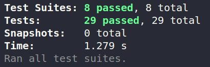
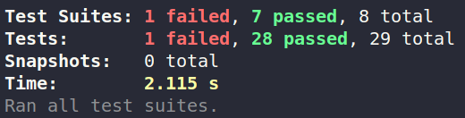
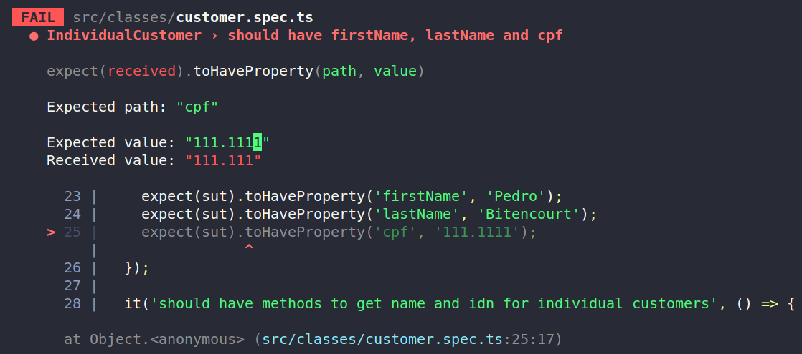

# Creating Mocks in Jest for Unit Testing: Practical Examples

## Theoretical Explanation


### Introduction

**Software tests** verify if a program exhibits the waited answers. They can be manual or **automatic**. It's crucial to emphasize that tests show the presence of bugs, but not the absence of them, as stated by Dijkstra

If you want, you can study the subject before practicing. If so, i recommend the [chapter 8](https://engsoftmoderna.info/cap8.html) of the book [Engenharia de Software Moderna](https://engsoftmoderna.info). But unfortunatelly for some, this book is in Portuguese.

Our objective is to allow that the student have a first contact with **Jest's mocks for unit testing**

Before practice, we are going to explain a little bit more about software tests.

Tests can be divided into three groups:

- **Unit tests** verify automatically small parts of a code. The majority of tests are unit ones, because they are simple, easy to implement and it is quick to execute

- **Integration tests** or **service tests** check if a complete function or transaction of a system. Thereafter, they are a test type that uses a lot of classes of distinct packages. This test type usually demands more effort and execute slower than the unit test

- **System tests** simulate, as faithfully as possible, a real user's session using the system. Since they are end-to-end tests, they are more expensive, slower, and less numerous. Interface tests are often fragile as well, meaning that even minor changes to interface components may require modifications to these tests.

It is said that code has a defect—or a **bug**, in a more informal sense—when it does not conform to its specification. If defective code is executed and causes the program to produce an incorrect result or behavior, we say that a **failure** has occurred.

### Unit tests

**Unit tests** are automated tests of small units of code, typically classes, which are tested in isolation from the rest of the system. A unit test is a program that calls methods of a class and checks if they return the expected results. Thus, when using unit tests, the code of a system can be divided into two groups: a set of classes that implement the system's requirements and a set of tests.

Next, there will be some definitions:

- **Test**: A method that implements a test. It is also referred to as test method

- **Test Cases**: A class containing test methods

- **Test Suite**: A collection of test cases that are executed by the unit testing framework (which in our case is *Jest*).

- **System Under Test (SUT)**: The system being tested. It is a generic term also used in other types of testing, not necessarily unit testing. Sometimes the term production code is also used, referring to the code that will be executed by the system's clients."

<br>

**When should I write unit tests?**

- After implementing a small functionality

- Alternatively, you could write unit tests before implementing any production code

- For example, when a user reports a bug, you can start the analysis by writing a test that reproduces the bug, and, as a result, it will fail.

- You can also write tests when you are debugging a piece of code.

- What is NOT advisable is to postpone the implementation of all tests until the system is completed, as was the case, for example, in Waterfall development.

<br>

**What are the pros of using unit tests?**

- The main benefit of unit tests is to find bugs during the development phase, before the code goes into production when the costs of correction and potential losses can be higher.

- First, unit tests serve as a safety net against code regressions.
  - We say that a regression occurs when a change made to a system's code—whether to fix a bug, implement a new feature, or perform a refactoring—ends up introducing a bug or a similar issue into the code.

- Unit tests also assist in documenting and specifying production code. Therefore, often, when a developer needs to work with code they are not familiar with, they begin by examining its tests.


### Principles and Bad Smells

Unit tests should satisfy the following properties (whose initials give rise to the word FIRST in English):

- **Fast**: Developers should run unit tests frequently to obtain quick feedback on bugs and code regressions.
  - Therefore, it is important that they are executed quickly, in a matter of milliseconds.

  - If that's not possible, you can split a test suite into two groups: tests that run quickly and will therefore be called frequently, and more time-consuming tests that might, for example, be run once a day.

- **Independent**: The execution order of unit tests is not important.
  - For any tests T1 and T2, the execution of T1 followed by T2 should yield the same result as the execution of T2 followed by T1.

  - It can also happen that T1 and T2 are executed concurrently.

  - For tests to be independent, T1 should not alter any part of the global state of the system that will later be used to compute the result of T2, and vice versa.

- **Repeatable**: Unit tests should always yield the same result.
  - In other words, if a test T is called n times, the result should be the same in all n executions. That is, either T passes in all executions, or it always fails.

  - Tests with non-deterministic results are referred to as **Flaky Tests** (or **Erratic Tests**). Concurrency is one of the primary factors responsible for *flaky* behavior.

- **Self-checking**: The result of a unit test should be easily verifiable.
  - To interpret the test result, the developer should not, for example, have to open and analyze an output file or provide data manually.

  - Instead, the test results should be binary and displayed within the IDE, typically through components that are either green (indicating that all tests have passed) or red (indicating that some test has failed).

- **Timely**: The test can be written even before than the code that will be tested

<br>

There are some **Test Smells** that we should avoid, such as:

- **Obscure Test**: An obscure test is a lengthy, complex, and hard-to understand test. As we mentioned, tests should also serve as documentation for the System Under Test. Therefore, it's crucial that they have clear and easily comprehensible logic. Ideally, a test should, for instance, verify a single requirement of the System Under Test

- **Conditional Logic in Tests**: Tests with conditional logic include code that may or may not be executed. In other words, they are tests with if statements or loops, whereas it's preferred that unit tests are linear. Conditional logic in tests is considered a code smell because it hinders test comprehension.

- **Code Duplication in Tests**: As the name suggests, code duplication in tests occurs when the same code is repeated in multiple test methods.

### Mocks

Now, that you know all of this, it's important to point out what **Mocks** are.

**Mocks** are fake objects, functions or modules that mimic the behavior of real components, allowing you to isolate and test specific parts of your code without relying on or affecting external dependencies. Mocks are commonly used in unit testing to create controlled environments for testing individual units of code, such as functions or methods. Using mocks permits that we can create a unit test without accessing a remote service, for example.

In most cases, you set up a mock to provide predetermined responses or behavior that are simple and predictable. For example, a mock might always return a specific value, throw an exception, or log a message when it's called. These simple behaviors are defined by you, the developer, to simulate the expected interaction with the real component, making it easier to test the code that uses the component.

While mocks are usually simple, they can also be configured to have more complex behaviors if needed. However, the primary goal is to keep them as simple as possible to ensure the test's focus remains on the code being tested and not on the intricacies of the mocked component.

In the context of mocking, you will often encounter terms like:
- **Stub**: It is a type of mock that provides predefined responses to method calls, but it does not verify whether the methods are called or not

- **Mock**: A mock, in the stricter sense, is a mock object that both provides predefined responses and verifies whether specific methods are called during the test

- **Spy**: A spy is a type of mock that "watches" real objects or functions and records information about their method calls, allowing you to inspect their behavior.

## Practical Explanation

First and foremost, It's worth noting that usually if a file is named, for example, *index.ts*, its test file usually is named *index.spec.ts* or *index.test.ts*

There are some folders on *src* folder. The folder *examples* contains a typescript file (test-jest-assertions.spec.ts) that helps to show how *unit testing with jest* works

### Test suites

Firstly, you can create tests suites, promoting organization. A **test suite** is a function that group related tests cases. To create a test suite using Jest, you do the following:
```
describe('description of the test block', function that contains the tests)
```

### Test

Thereafter, inside its function, you have to define individual tests cases in the following way:

```
it('test description', test function)
```

**OR**

```
test('test description', test function)
```

Inside each test, there is, at least, one *expect* function to test a value. There are a lot of tests that can be done, so we're going to show the most important ones.

```
const number = 10;
expect(number).toBe(10);
expect(number).toEqual(10);
```

The above example tests if the variable *number* is equal to 10. The opposite could be done with:
```
expect(number).not.toBe(10);
expect(number).not.toEqual(10);
```

To verify if an object has a property, we can do the following:
```
expect(obj).toHaveProperty('property');
```

Furthermore, we can check if the object has a property and if its property has a certain value:

```
expect(obj).toHaveProperty('property', value);
```

All things considered, we can understand what ***jest.clearAllMocks()*** is doing. It is resetting and clearing any mocks created or used within each test case, ensuring a **clean state** for subsequent tests. Moreover, ***jest.spyOn*** is a function used to created mock spies for tracking the behavior of functions or methods in your code during testing. **Spies** are helpful when you want to monitor whether specific functions have been called, with what arguments and how many times they were invoked

***jest.spyOn*** works in the following way:

1. **Creating a Spy**

    You use *jest.spyOn* to create a spy for a specific object and method.
    ```
    jest.spyOn(object, 'methodName');
    ```
    - object: The object or module that contains the method you want to spy on

    - methodName: The name of the method you want to spy on

2. **Configuring Spy Behavior**


    After creating a spy, you can define its behavior. For example, you can make it return a specific value or throw an exception when called. You can configure the spy like this:
    ```
    jest.spyOn(object, 'methodName').mockReturnValue('mockedReturnValue');
    ```

3. **Using the Spy in Tests**

    You then use the spy in your test cases to monitor the method's behavior. You can call the method as you normally would in your code, and the spy will keep track of these calls.

4. **Assertions**

    In your test, you can make assertions to verify how the spy was used. For example, you can check if the method was called with specific arguments or determine how many times it was invoked. Jest provides various matchers for these assertions, like '*toHaveBeenCalled*', '*toHaveBeenCalledWith*', and '*toHaveBeenCalledTimes*'.

    Here's an exemple of using '*jest.spyOn*':
    ```
    // Suppose you have a simple object with a method.
    const myObject = {
      add: (a, b) => a + b,
    };

    // Create a spy for the `add` method.
    const addSpy = jest.spyOn(myObject, 'add');

    // Configure the spy behavior.
    addSpy.mockReturnValue(5);

    // Use the spy in a test.
    const result = myObject.add(2, 3);

    // Assertions
    expect(result).toBe(5); // The result is the mocked return value.
    expect(addSpy).toHaveBeenCalledWith(2, 3); // The method was called with the expected arguments.
    expect(addSpy).toHaveBeenCalledTimes(1); // The method was called exactly once.
    ```

If you want to know more about ***jest***, you can learn it in this [page](https://jestjs.io/docs/jest-object)

In case you now understand what unit testing with Jest is, practice, as it's the best way to learn. There are TypeScript codes for you to study and practice unit testing with jest
<br>

### *order.spec.ts* explanation

Now, we're going to explain the test made for *order.ts* file.

The *ShoppingCartMock* class is a mock, so, like it was said before, it mimics the behavior of a real object and provides predetermined responses that are simple and predictable. The same can be said about *CustumerMock*, *MessagingMock* and *PersistencyMock* classes.

- The *ShoppingCartMock* mimics *ShoppingCart* object (that's why it has to implement *ShoppingCartProtocol* interface)

- The *ShoppingCartMock total* method just returns a predetermined and predictable answer, making it easier to test

```
class ShoppingCartMock implements ShoppingCartProtocol {
  get items(): Readonly<CartItem[]> {
    return [];
  }
  addItem(item: CartItem): void {}
  removeItem(index: number): void {}
  total(): number {
    return 1;
  }
  totalWithDicount(): number {
    return 2;
  }
  isEmpty(): boolean {
    return false;
  }
  clear(): void {}
}

class MessagingMock implements MessagingProtocol {
  sendMessage() {}
}

class PersistencyMock implements PersistencyProtocol {
  saveOrder() {}
}

class CustomerMock implements CustomerOrder {
  getName() {
    return '';
  }
  getIDN() {
    return '';
  }
}
```

<br>

The *createSut* function is an implementation of a design pattern, specifically the **Factory Method** pattern.

<br>

There is only one *describe* function, so there is only ONE **Test Suite**. This suite contains test cases related to the *order.ts* file. For this reason, its description is: ***Order***. Inside of it, there are five **test cases** (each *it* function is one test case).
Inside each test case, there is, at least, one **test**, represented with *expect* function

<br>

**Analysing *should not checkout if cart is empty* test case:**

Let's analyse the following code:

```
it('should not checkout if cart is empty', () => {
    const { sut, shoppingCartMock } = createSut();
    const shoppingCartMockSpy = jest
      .spyOn(shoppingCartMock, 'isEmpty')
      .mockReturnValueOnce(true);
    sut.checkout();
    expect(shoppingCartMockSpy).toHaveBeenCalledTimes(1);
    expect(sut.orderStatus).toBe('open');
  });
```

- It spies on the *isEmpty* method of the *shoppingCartMock* object. Spying means it's monitoring that method to see if and how it's called during the test.

- With *mockReturnValueOnce(true)*, it specifies that when *isEmpty* is called, it should return true just this one time. This is a way to control the behavior of the *shoppingCartMock* during the test.

- The *sut.checkout()* method is called, which is the action being tested.

- Two expectations (assertions) are made:
  - *expect(shoppingCartMockSpy).toHaveBeenCalledTimes(1)* checks if the *isEmpty* method was called exactly once. This verifies that the checkout method indeed relied on this *isEmpty* method.

  - *expect(sut.orderStatus).toBe('open')* checks if the *orderStatus* property of sut is 'open'. This is an additional expectation to make sure that after calling checkout, the order status is not changed (it remains 'open').


<br>

## Technologies

- Node
- TypeScript
- Jest

## Installation

Now we're going to describe the installation process.

1. Fork the repository. For that, click on **Fork** button
2. Open the terminal of you operational system in the folder that will contain the project and **clone** the repo:
```
git clone https://github.com/<SEU USUÁRIO>/Creating-Mocks-in-Jest-for-Unit-Testing
```

3. Install Node.js if you don't have it on this [page](https://nodejs.org/en/download/)

4. In a terminal, go to the project's directory and install the required dependencies:

```
npm install
npm i jest ts-jest @types/jest -D
```

## Testing

Make sure that you have the *package.json* file

To run the testing files, you have three options:

With the option below, it will execute the Jest testing framework, which will run your tests and provide you with the test results and any failures.
```
npm run test
```

<br>

The option below (*npm run test:silent*) is a variant of *npm run test* with additional options, such as:
- watchAll: This option makes Jest run in watch mode, where it continuously monitors your project files for changes and re-runs the tests whenever there's a change.

- silent:  This option suppresses most of Jest's console output, making it less verbose.

- noStackTrace: This option disables printing stack traces for test failures, further reducing the verbosity of the output
```
npm run test:silent
```

<br>

The option below (*npm run test:coverage*) is also a variant of *npm run test* with additional options, such as:
- coverage: This option instructs Jest to collect code coverage information during the test run. It generates a code coverage report that shows which parts of your code have been tested and which haven't. This is helpful for assessing the quality of your tests and identifying areas of your code that may need more test coverage

- silent

- noStackTrace
```
npm run test:coverage
```

### Possible results:

If you run the test, there are two possible results:

All tests passed:
<p align="center">
  
</p>

At least one test hasn't passed:
<p align="center">
  

  In the terminal output, there will be highlighted with red which test(s) failed, displaying the test suite, test description, expected output, and actual output.
</p>

<p align="center">
  
</p>

It helps finding bugs easily.


## Practical Exercise

In the **exercise.ts** file, in the "exercise" folder, there is a program that reads JSON objects of type person, containing name, email, salary, among others. Your **goal** is to create two unit tests using an async function to mock the actual reading of the file by the fetchUserData function.

- **Tip**: use the Async syntax to create a function that returns a promise

The first test should focus on verifying whether the "fetchUserData" function correctly returns the user data. Ensure that the function can accurately retrieve the expected user details.

The second test should be dedicated to handling potential errors when making an API call within the "fetchUserData" function. This test should address scenarios where the API call might fail, and you should confirm that the function handles such errors gracefully.

In both cases, use appropriate testing techniques and tools to ensure the reliability and robustness of the "fetchUserData" function. Additionally, make use of asynchronous testing methods to handle promises and asynchronous operations effectively.

After attempting and not succeeding, please check the answer within the '**answer**' folder in the 'exercise' directory.


## Contributing

We welcome contributions from the community to improve and expand this project. Whether you want to report a bug, suggest an enhancement, or submit your own code changes, please follow the guidelines below to make the process smooth and efficient.

### Reporting Issues

If you encounter a bug, have a feature request, or want to discuss something related to the project, please feel free to [open an issue](https://github.com/pedromelobitencourt/Creating-Mocks-in-Jest-for-Unit-Testing). When reporting an issue, be sure to include the following information:

1. A clear and descriptive title.
2. A detailed description of the issue or feature request.
3. Steps to reproduce the issue, if applicable.
4. Information about your environment (e.g., operating system, version of the project, relevant dependencies).
5. Screenshots, if they can help in understanding the issue.

### Making Code Contributions

If you want to contribute code to the project, please follow these steps:

1. Fork this repository to your own GitHub account
2. Clone your forked repository to your local development environment

```
git clone https://github.com/pedromelobitencourt/Creating-Mocks-in-Jest-for-Unit-Testing
```

3. Create a new branch for your changes
```
git checkout -b feature/your-feature
```

4. Make your changes and commit them with descriptive messages
```
git commit -m "Add new feature"
```

5. Push your changes to your forked repository
```
git push origin feature/your-feature
```

6. Open a pull request to the main repository. Be sure to provide a clear and concise description of your changes.

## License

This script and code were created by the group consisting of:
- Lucas Rafael Alves de Souza (20213002117)
- Pedro Vitor Melo Bitencourt (20213001540)
- Rafael Pereira Duarte (20213005146)
- Sérgio Henrique Mendes de Assis (20213005182)

 We are undergraduate students in the Computer Engineering program at CEFET-MG. This script and code are part of a software engineering laboratory assignment for the class of 2023/2. Both the code and the script are under the MIT license.
